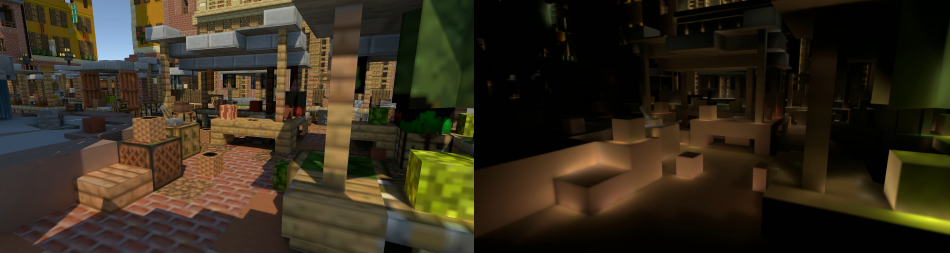

# Screen Space Ray Tracing

Real-time indirect diffuse illuminaton using screen-space information for Unity.

# Features
* One bounce indirect diffuse lighting.
* Ambient occlusion.
* Support of emissive surfaces as indirect light source.
* Fallback to Unity ambient or cubemap based ambient.

# Limitations
* Currently still using legacy rendering pipeline.
* Works only with Deferred rendering.

# Installation

Copy the SSRT folder in the Asset folder of your Unity project, and add the SSRT component on the main camera. Tested with Unity 2019.1.1f1.

The project needs to be in __linear__ color space, and the camera should use __deferred__ rendering.

It's *highly recommended* to add the latest post-processing stack package from the package manager and activate __temporal anti-aliasing__ on the main camera. This will help remove a lot of the noise.

# Usage

There are keyboard shortcuts to enable/disable SSRT, mapped to the following numbers:

* 1 = SSRT On.
* 2 = SSRT Off.
* 3 = Indirect lighting with texture.
* 4 = Indirect lighting only.
* 5 = SSRT On with AO enabled also on direct lighting.
* H = Set half resolution rendering.
* F = Set full resolution rendering. 

# Properties

### Sampling
* __Rotation Count:__ Number of directionnal rotations applied during sampling.
* __Step Count:__ Number of samples taken along one edge of the current conic slice. The total number of samples taken per pixel is rotationCount * stepCount * 2.
* __Radius:__ Effective sampling radius in world space. AO and GI can only have influence within that radius.
* __Exp Start / Exp Factor:__ Controls samples distribution. Exp Start is an initial multiplier on the step size, and Exp Factor is an exponent applied at each step. By using a start value < 1, and an exponent > 1, it's possible to get exponential step size.
* __Jitter Samples:__ Applies some noise on sample positions to hide the banding artifacts that can occur when there is undersampling.

### GI
* __GI Boost:__ Intensity of the indirect diffuse light.
* __Light Buffer HDR:__ Using an HDR light buffer gives more accurate lighting but have an impact on performances.
* __Light Buffer Resolution:__ Using lower resolution light buffer can help performances but can accentuate aliasing.
* __LnDl Offset:__ Bypass the dot(lightNormal, lightDirection) weighting.
* __nDl Offset:__ Bypass the dot(normal, lightDirection) weighting.

### Occlusion
* __Power:__ Power function applied to AO to make it appear darker/lighter.
* __Thickness:__ Constant thickness value of objects on the screen in world space. Is used to ignore occlusion past that thickness level, as if light can travel behind the object.
* __Falloff:__ Occlusion falloff relative to distance.
* __Multi Bounce AO:__ Multi-Bounce analytic approximation from GTAO.
* __Direct Lighting AO:__ Composite AO also on direct lighting.

### Offscreen Fallback
* __Fallback Method:__ Ambient lighting to use. Off uses the Unity ambient lighting, but it's possible to use instead a static irradiance cubemap (pre-convolved), or render a cubemap around camera every frame (expensive).
* __Cubemap Fallback:__ Static irradiance cubemap to use if it's the chosen fallback.

### Filters
* __Resolution Downscale:__ The resolution at which SSRT is computed. If lower than fullscreen the effect will be upscaled to fullscreen afterwards. Lower resolution can help performances but can also introduce more flickering/aliasing. __Important:__ resolution needs to be divisible by 2 when using downscaling or it can introduce artifacts. Use a fixed resolution instead of free aspect.
* __Reuse Count:__ Number of neighbor pixel to reuse (helps reduce noise).
* __Temporal Enabled:__ Enable/Disable temporal reprojection.
* __Temporal Response:__ Controls the speed of the accumulation, slower accumulation is more effective at removing noise but can introduce ghosting.

### Debug Mode
* __Debug Mode:__ View of the different SSRT buffers for debug purposes.
* __Light Only:__ If enabled will show only the radiance that affects the surface, if unchecked radiance will be multiplied by surface albedo.

# Credits
The following code has been developed at [CDRIN](https://www.cdrin.com/) by Olivier Therrien as a R&D project on real-time global illumination.

# License

The SSRT code is under MIT license (See LICENSE file).

The Plaza model is made by [patrix](https://sketchfab.com/patrix), is under [CC Attribution-NonCommercial-ShareAlike](https://creativecommons.org/licenses/by-nc-sa/4.0/) license, and comes from [here](https://skfb.ly/6IYFE).

# Acknowledgements

This project drew a lot of inspiration from the following work:

* [Multi-Scale Global Illumination](http://wili.cc/research/quantum_break/) in Quantum Break.
* [GTAO](https://community.activision.com/t5/Publications/Practical-Real-Time-Strategies-for-Accurate-Indirect-Occlusion/ba-p/10002180) paper from Activision.
* [GTAO](https://github.com/MaxwellGengYF/Unity-Ground-Truth-Ambient-Occlusion) implementation for Unity from MaxwellGengYF.
* Sonic Ether's [SEGI](http://www.sonicether.com/segi/).

